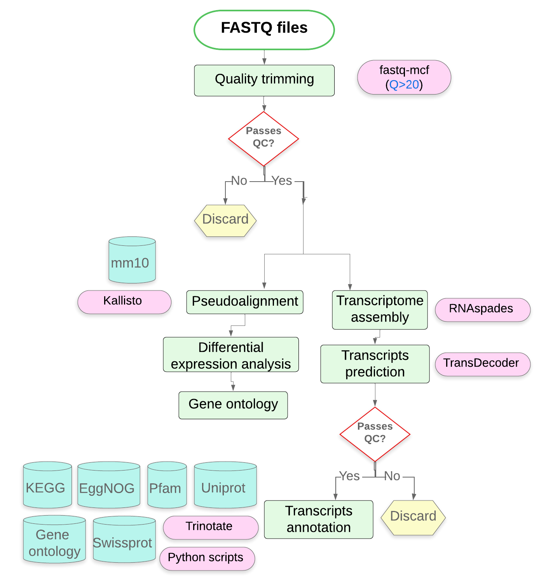
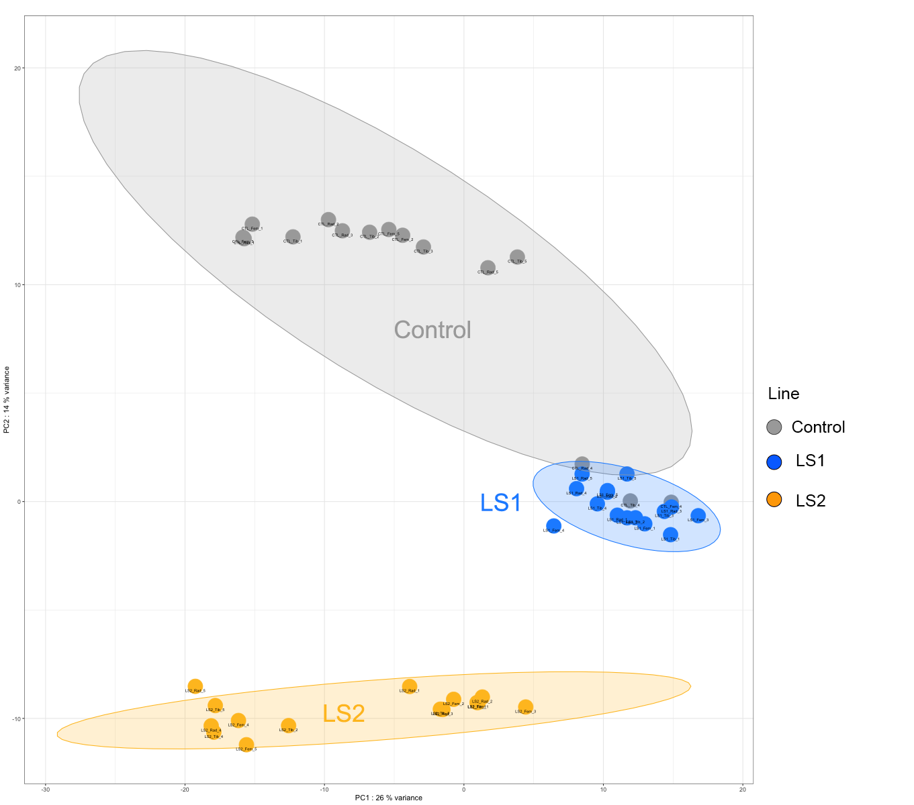
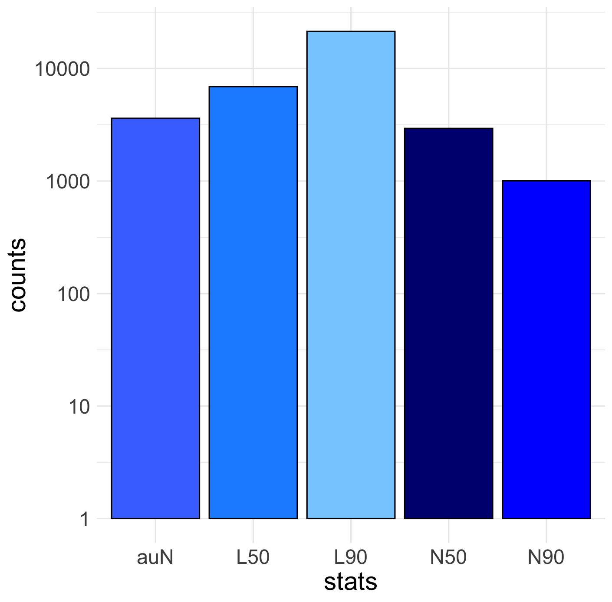
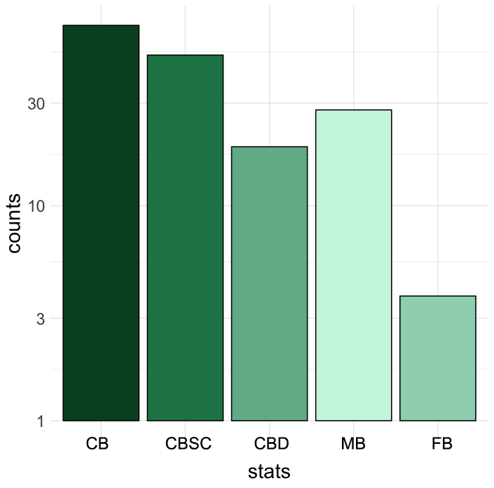

# Long shank neonates

### Principal Investigator: Colton Unger (Campbell Rolian)
### Institution: Faculty of Veterinary Medicine, University of Calgary

### Important notes
All data mentioned in this document can be found at:
https://uofc-my.sharepoint.com/:f:/r/personal/juan_jovel_ucalgary_ca/Documents/jj/UofC/data/coltonUnger/LongshanksNeonateLim?csf=1&web=1&e=ubHTif

However, only authorized users hace access to such data. To request access, contact Colton Unger (cmunger@ucalgary.ca).

All scripts mentioned here and not included in full are stored in this repo.

## Description of Project

The long bones of the postcranial skeleton develop by the highly conserved process of endochondral ossification (EO), where bones elongate by the action of structurally similar growth plates situated on the ends of the bones. The shared process of EO raises the possibility that long bones may evolve together when a strong selection pressure is applied to change a specific bone, in a process called correlated evolution. We investigated the potential for correlated skeletal change using the Longshanks mouse (LS), which has been selectively bred to have 15-20% longer tibiae compared to Controls and found that all the postcranial bones elongated in response to tibia evolution. To investigate the developmental basis of these correlated changes, we applied next generation sequencing (NGS) on developing LS and Control bones to attempt to identify altered EO pathways in multiple LS bones.

## Bioinformatics

An overview of the bioinformatics pipeline is presented hereafter:



### 1. Description of datasets

Three mice genotypes, Control, LS1 and LS2, were used for processing with this bioinformatics pipeline. LS1 and LS2 exhibits longer tibiae. Initial PCA plots identified a single control animal as an apparent outlier and was eliminated from analysis. 




The main directory of the project in ARC is:
'/work/vetmed_data/jj/projects/coltonUnger/LongshanksNeonateLim'


#### 2. Quality trimming

```bash
for FILE in *_R1.fq.gz
do
    fastq-mcf ~/useful_files/adapters.fa -o ${FILE/_R1.fq.gz/}R1_trimmed.fq -o ${FILE/_R1.fq.gz/}R2_trimmed.fq $FILE ${FILE/_R1/_R2} -k 0 -l 50  -w 3 -q 20
done
```

The number of reads in each library, before and after trimming is recorded in file `number_of_reads_per_sample.xlsx`. Number of reads per sample after trimming ranged between 22.4 and 65.7 million reads with a mean of 47 million reads.

#### 3. Quantification with Kallisto

##### 3.1 Indexing the transcriptome

```bash

kallisto index -i Mus_musculus.GRCm39.cdna.all.idx Mus_musculus.GRCm39.cdna.all.fa

``` 

##### 3.2 Quantification of transcripts with kallisto

``` bash

INDEX=/work/vetmed_data/jj/projects/coltonUnger/LongshanksNeonateLim/mm_GRCm39_plusNovel.idx

for FILE in *_R1.fq.gz
do
        kallisto quant -i $INDEX --bias -b 100 -o ${FILE/_R1.fq.gz/}_kallisto --threads 12 $FILE ${FILE/_R1/_R2}
done
```

##### 3.3 Parse kallisto results

```bash

for DIR in *_third-kallisto
do
        cut -f 1 ${DIR}/abundance.tsv > names
        cut -f 4 ${DIR}/abundance.tsv | sed 1d | sed '1s/^/'$DIR'\n/' | sed 's/_kallisto//' > ${DIR}.counts
        cut -f 5 ${DIR}/abundance.tsv | sed 1d | sed '1s/^/'$DIR'\n/' | sed 's/_kallisto//' > ${DIR}.tpms
done
echo "Counts and tpms have been extracted"

COUNTS_FILE='all_samples_counts.tsv'
TPMS_FILE='all_samples_tpms.tsv'


# Paste all counts columns after names
paste names *counts > $COUNTS_FILE
# Paste all tpms columns after names
paste names *tpms > $TPMS_FILE
echo "All samples were pasted in a single file"

rm names *counts *tpms
echo "Intermediate files were deleted"

echo "Your consolidated counts are at: $COUNTS_FILE" 
echo "Your consolidated tpms are at: $TPMS_FILE
```

#### 4. Differential expression analysis

Differential expression analyses was conducted with DESeq2, using script `DESeq2.R`. It requires the counts file `all_samples_counts.tsv` and the metadata file 'metadata.tsv', both of which can be downloaded from this repo.

#### 5. Gene ontology analysis

Gene ontology analysis was conducted on the results from the previous step and was conducted with script `clusterProfiler.R` and requires the same input files as script `DESeq2.R`.


#### 6. Assembly

For assembly, all files corresponding to end1 (R1) and end2 (R2) were concatenated into two files: `longshanksNeonateLim_R1.fq` and `longshanksNeonateLim_R2.fq`. The assember `rnaSPAdes` was used with the following command line:

```bash
rnaspades.py -t 12  -1 longshanksNeonateLim_R1.fq  -2 longshanksNeonateLim_R2.fq -o longshanksNeonateLim_RNAspades_assembly
```

This resulted in 67,858 contigs.


#### Evaluation of assembly

Assembly was evaluated using Quality Assessment Tool for Genome Assemblies (QUAST) and Benchmarking Universal Single-Copy Orthologs (BUSCO).

```bash
# QUAST
quast.py transabyss_2.0.1_assembly/transabyss-final.fa -o "Rt_${name}_transabyss_quast" --fast


# BUSCO
DIR="/work/vetmed_data/jj/projects/jeffBiernaski/reindeer/transcriptome_assembly/simb_links/"
LINNEAGE="${DIR}/mammalia_odb10"
INFILE="longShank_RNAspades_assembly.fa"
OUTDIR="longShank_RNAspades_assembly_busco"

busco -ii "$INFILE"  -l "$LINNEAGE" -o "$OUTDIR" -m transcriptome -c 48

```

Here a summary of assembly results:

QUAST



BUSCO




```bash
    TransDecoder.LongOrfs -t longShank_RNAspades_assembly.fa
```

This tool works by scanning transcript sequences for ORFs that are long enough to be potential protein-coding regions. It typically looks for standard start and stop codons and uses the length of the ORF as one of the criteria for predicting coding regions.

In a second step, we applied the sister program `TransDecoder.Predict`. TransDecoder.Predict is designed to analyze the ORFs identified by TransDecoder.LongOrfs (or other methods) and determine which of these are most likely to represent actual protein-coding regions.  TransDecoder.Predict searches for the presence of known protein domains.

```bash
   TransDecoder.Predict -t longShank_RNAspades_assembly.fa  
```

TransDecoder.Predict implicitly relies on the intermediate files generated by TransDecoder.LongOrfs. It uses these files to analyze the ORFs and predict which ones are likely to be true protein-coding regions. By default, it looks at directory `longShank_RNAspades_assembly.fa.transdecoder_dir` in the same directory where TransDecoder.LongOrfs was run and uses the intermediate files generated by this latter one to predict putative coding ORFs.

This resulted in 29,536 predicted proteins, which are stored in files `longShank_RNAspades_assembly.fa.transdecoder.cds` and `longShank_RNAspades_assembly.fa.transdecoder.pep` containing, respectively, DNA and protein predicted sequences.

From those, only complete ORFs were extracted (5' and 3' moeities were excluded). This produced 19,574 putatively novel transcripts, and they are stored in file `longShank_RNAspades_assembly.fa.transdecoder_complete.fasta` and `longShank_RNAspades_assembly.fa.transdecoder_complete.pep`.

Complete ORfs were extracted with the following commands:

```bash
    perl extract_complete_ORFs.pl longShank_RNAspades_assembly.fa.transdecoder.cds > longShank_RNAspades_assembly.fa.transdecoder_complete.fasta

    perl extract_complete_ORFs.pl longShank_RNAspades_assembly.fa.transdecoder.pep > longShank_RNAspades_assembly.fa.transdecoder_complete.pep

```

More generally, if any subset of a FASTA file needed to be extracted, the subset of IDs was extracted and used for pulling out from a FASTA file as follows:

```bash
    # For nucleotide sequences
    perl extract_nt_records.pl <fasta-file> <ids-file> > <output.fasta>

    # For protein sequences
    perl extract_protein_records.pl <fasta-file> <ids-file> > <output.fasta>
```

Such putative transcripts were subjected to annotation with the Trinotate pipeline (https://github.com/Trinotate/Trinotate/wiki). 

Initially, an sqlite database is crated and populated with databases for comparison of nucleotide and protein sequences. 

```bash
Trinotate --db reindeer_transc.db --create --trinotate_data_dir trinotate_db
```

Then, sqlite database was initialized by importing nucleotide and protein sequences.

```bash
Trinotate --db longshank_transc.db \
        --init \
        --gene_trans_map "longShank_putative_novel_transcripts_shortID_gene-map.txt" \
        --transcript_fasta "longShank_RNAspades_assembly.fa.transdecoder_complete.fasta" \
        --transdecoder_pep "longShank_RNAspades_assembly.fa.transdecoder_complete.pep"
```

 The gene-map file was created with the following command:

```bash
# generation of a gene-map file
awk '{ if ($0 ~ /^>/) { id=substr($0,2); print id "\t" id } }'  longShank_RNAspades_assembly.fa.transdecoder_complete.fasta > longShank_putative_novel_transcripts_shortID_gene-map.txt

```

Trinotate was run:

```bash
DB_PATH="longshank_transc.db"

Trinotate --db ${DB_PATH} \
--run ALL \
--CPU 12 \
--transcript_fasta "longShank_RNAspades_assembly.fa.transdecoder_complete.fasta" \
--transdecoder_pep "longShank_RNAspades_assembly.fa.transdecoder_complete.pep"

Trinotate --db ${DB_PATH} --LOAD_swissprot_blastp uniprot_sprot.ncbi.blastp.outfmt6
Trinotate --db ${DB_PATH} --LOAD_pfam TrinotatePFAM.out
Trinotate --db ${DB_PATH} --LOAD_signalp6 sigP6outdir/prediction_results.txt
Trinotate --db ${DB_PATH} --LOAD_EggnogMapper eggnog_mapper.emapper.annotations
Trinotate --db ${DB_PATH} --LOAD_tmhmmv2 tmhmm.v2.out

Trinotate --db ${DB_PATH} --LOAD_swissprot_blastx uniprot_sprot.ncbi.blastx.outfmt6
Trinotate --db ${DB_PATH} --LOAD_infernal infernal.out
```
And results were extracted into a tabular report:

```bash
    Trinotate --db  longshank_transc.db --report > longshank_transc_Trinotate_report.tsv
```

Reads for which Trinotate found annotations can be extracted with the following command line:

```bash
    cut -f 1 longShank_RNAspades_assembly.fa.transdecoder_complete.fasta | sed 's/>//' | grep - longshank_transc_Trinotate_report | cut -f 1,3 | awk '$2 != "."' >  ``longShank_RNAspades_assembly.fa.transdecoder_complete_trinotate_annotations.txt`
```

Out of XXXX reads subjected to annotation in file `longShank_RNAspades_assembly.fa.transdecoder_complete.fasta`, XXXX got annotations and those annotations were saved in file `longShank_RNAspades_assembly.fa.transdecoder_complete_trinotate_annotations.txt`.  

Unique protein IDs were extracted from the Trinotate report with the following command:

```bash
cut -f 3 longShank_RNAspades_assembly.fa.transdecoder_complete_trinotate_annotations.txt | cut -d '^' -f 1 | sed '/^\.$/d' | sort | uniq > unique_longshank_protein_ids_list.txt 
```

Annotation for such proteins were retrieved from the Uniprot database:

```bash
python retrieve_protein_annotations_uniprot.py unique_reindeer_protein_ids_list.txt > protein_ids_annotated_uniprot.txt 
```

The following files were used for annotation the ID of files:

longshank_assembly_annotations_uniprot.tsv
ongShank_RNAspades_assembly.fa.transdecoder_complete_trinotate_annotations.txt
node_and_prot_ids.txt
longShank_RNAspades_assembly.fa.transdecoder_complete.fasta
longShank_RNAspades_assembly.fa.transdecoder_complete.pep

using script `annotate_fasta_id.pl`. The results were stored in the following files:

trinotate_report_table.tsv
trinotate_report_table.xlsx 
(a table with annotations for each transcript that could be annotated)

longShank_RNAspades_assembly.fa.transdecoder_complete_with_annotation.fasta
(All nuleotide reads that could be annotated)

longShank_RNAspades_assembly.fa.transdecoder_complete_with_annotation.faa
(All protein reads that could be annotated)

Annotated sequences were aligned agains the `Mus_musculus.GRCm39.cdna.all.fa` transcriptome and transcripts that did not aligned that reference were labelled as novel transcripts. Those are stored in file: `longShank_putative_novel_transcripts.fasta`.


